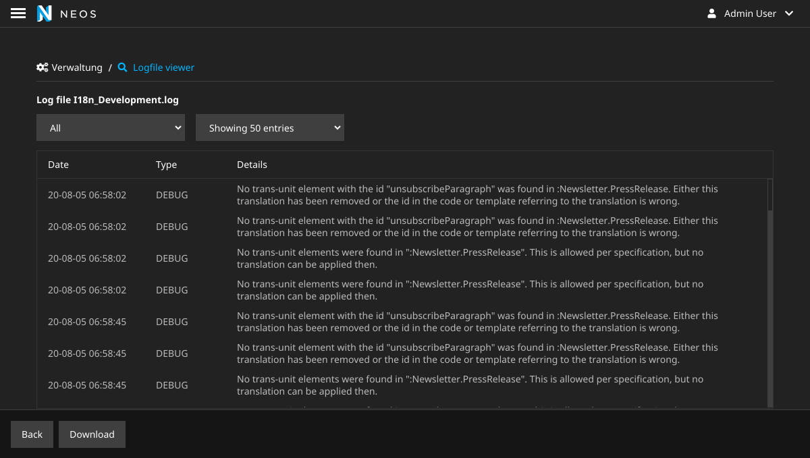
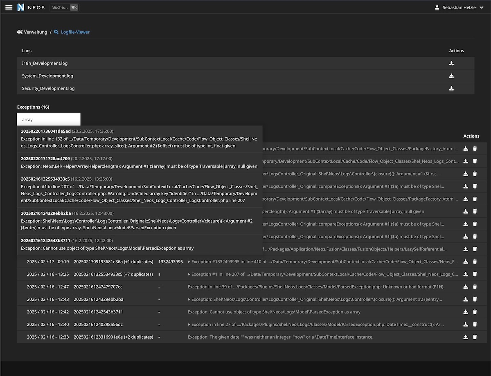
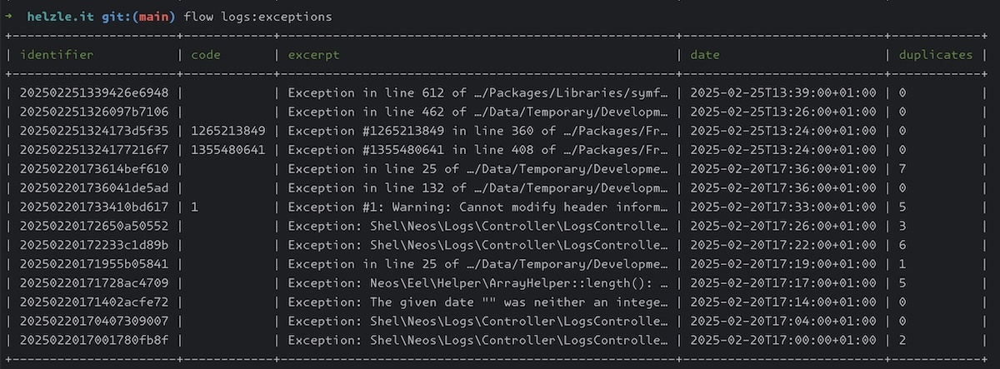

# Log file and exception viewer for Neos CMS   

[](https://packagist.org/packages/shel/neos-logs)
[](https://packagist.org/packages/shel/neos-logs)
[](https://packagist.org/packages/shel/neos-logs)

This package provides a new module in the [NeosCMS](https://www.neos.io) 
backend to view logs and exceptions of a Neos instance.

Usually it's recommended to use other, more powerful tools for this use case 
like [Sentry](http://sentry.io) or [Kibana](https://www.elastic.co/de/products/kibana), 
but there are cases in which those tools cannot be used.

This package was built to help in situations where one has to quickly investigate something, 
e.g. to understand an error the client had with their site.

## Features

* Backend module
  * View all logfiles in the `Data/Logs` directory
    * Filter log lines by their level
    * Download logfiles
  * View all exception files in the `Data/Logs/Exceptions` directory
    * Shows shortened excerpt for each exception 
    * Groups exceptions by their code or message to reduce clutter
    * Download exception files
    * Search for exceptions by code or their message
    * Mark recent exceptions
* CLI
  * List all exceptions as table
  * Show details of an exception

## Installation

Run this in your site package:

    composer require --no-update shel/neos-logs
    
Then run `composer update` in your project root.

## Usage

After the installation, you will have a new backend module in Neos - available only for administrators - 
that will allow you to view all local log and exception files.

Lines in the logfiles can be filtered by their level. You can also change the number of lines that should be visible.

### CLI

You can also use the CLI commands to list all exceptions or show details of a specific exception.

To list all exceptions:

```console
./flow logs:exceptions
```

To show details of a specific exception:

```console
./flow logs:showexceptions <exceptionId>
```

`<exceptionId>` is the filename of the exception file without the `.txt` extension.
If you don't provide an id, the command will list all exceptions, and you can choose one to show details.

## Examples

Overview screen:


Viewing a logfile:



Search in exceptions:



Exceptions in CLI:



## Contributions

Contributions are very welcome! 

Please create detailed issues and PRs.  

**If you use this package and want to support or speed up its development, [get in touch with me](mailto:hyphens@helzle.it).**

Or you can also support me directly via [patreon](https://www.patreon.com/shelzle).

## License

See [License](./LICENSE.txt)
